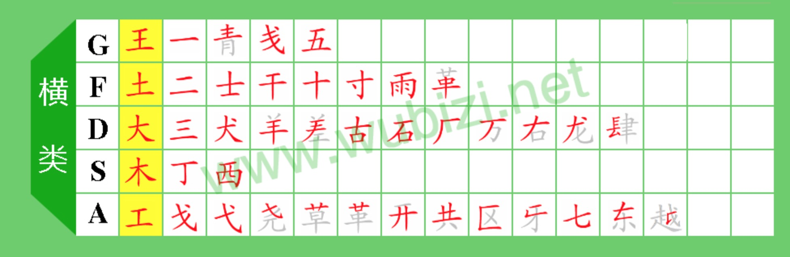
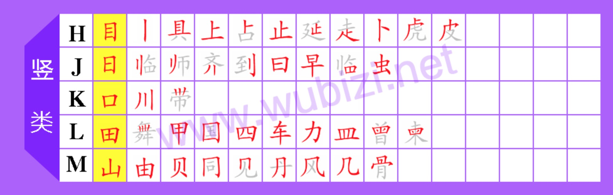
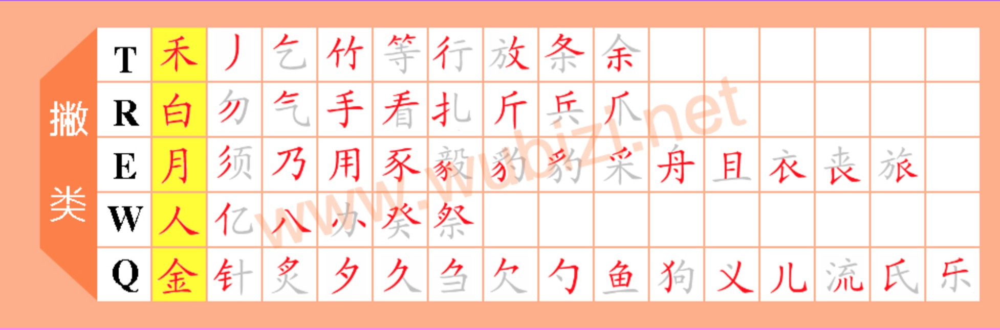
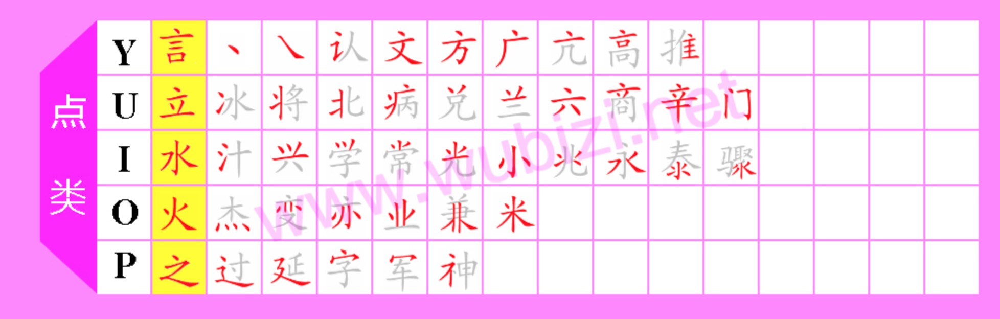
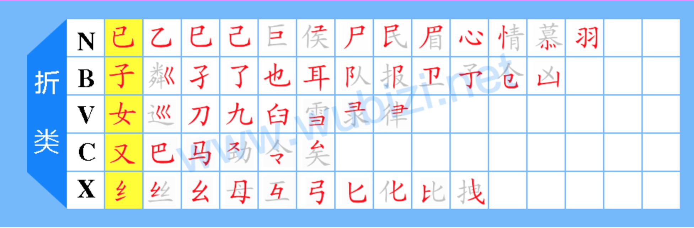

# FiveStrokeInputMethod
## 五笔输入法总结
### 一、字根
 

 

 

 

 

### 二、口诀  
11G 王旁青头戋（兼）五一  
12F 土士二干十寸雨  
13D 大犬三（羊）古石厂  
14S 木丁西  
15A 工戈草头右框七  

21H 目具上止卜虎皮  
22J 日早两竖与虫依  
23K 口与川，字根稀  
24L 田甲方框四车力  
25M 山由贝，下框几  

31T 禾竹一撇双人立，反文条头共三一  
32R 白手看头三二斤  
33E 月彡（衫）乃用家衣底  
34W 人和八，三四里  
35Q 金勺缺点无尾鱼，犬旁留儿一点夕，氏无七（妻）  

41Y 言文方广在四一，高头一捺谁人去  
42U 立辛两点六门疒  
43I 水旁兴头小倒立  
44O 火业头，四点米  
45P 之字军盖道建底，摘礻（示）衤（衣）  

51N 已半巳满不出己，左框折尸心和羽  
52B 子耳了也框向上  
53V 女刀九臼山朝西  
54C 又巴马，丢矢矣  
55X 慈母无心弓和匕，幼无力  

### 三、拆分原则  
书写顺序 取大优先 兼顾直观 能散不连 能连不交  
### 四、打法
#### ①键名汉字 (字根图片中换色部分)
打法: 连续打四次所在键位
#### ②一级简码
Q[我] W[人] E[有] R[的] T[和] Y[主] U[产] I[不] O[为] P[这]  
A[工] S[要] D[在] F[地] G[一] H[上] J[是] K[中] L[国]  
X[经] C[以] V[发] B[了] N[民] M[同]  
打法: 打一次所在键位,然后按空格键  
#### ③ 单笔画
T[丿] Y[丶] G[一] H[丨] N[乙]  
打法: 所在键位x2 + LL, 然后按空格键
#### ④成字字根  
打法: 所在键位+第一笔+第二笔(+最后一笔)
#### ⑤正常拆分
1) 可拆分2个字根  打法：字根1+字根2+识别码  
2) 可拆分3个字根  打法：字根1+字根2+字根3+识别码  
3) 可拆分4个字根  打法：字根1+字根2+字根3+字根4  
4) 可拆分4个以上字根  打法：字根1+字根2+字根3+最后一个字根  
#### ⑥识别码规则  
| 最后一笔 | 左右型 | 上下型 | 杂合型 |
|:-------:|:-----:|:-----:|:-----:|
| 一      | G     | F     | D     |
| 丨      | H     | J     | K     |
| 丿      | T     | R     | E     |
| 丶      | Y     | U     | I     |
| 乙      | N     | B     | V     |

识别码特殊情况  
1) 包含'辶'，'廴'的汉字,汉字的末笔取被包围部分的末笔。例:连、延  
2) 全包围结构的汉字, 汉字的末笔取被包围部分的末笔。例: 回、固  
3) 若'刀','九','力','匕','乃'是汉字的最后一个字根,则将它的末笔均看做折。 
4) 和'我','戋','成','戈'等含有“戈”部分的汉字,一律规定撇“丿”为其末笔。 
#### ⑦词语
1) 2字词  打法:每个字各取前两码
2) 3字词  打法:前2个字去第一码,第三个字取前两码 
3) 4字词  打法:每个字各取第一码  
4) 多字词(四字以上)  打法:前三个字和最后一个字各取第一码 